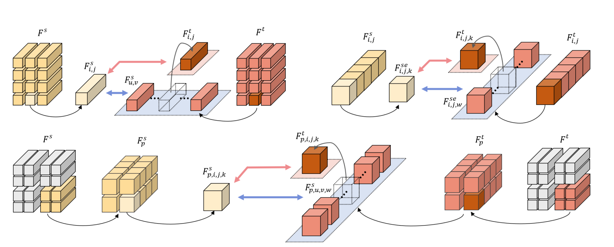

#  Augmentation-Free Dense Contrastive Knowledge Distillation for Efficient Semantic Segmentation
By Jiawei Fan, Chao Li, Xiaolong Liu, Meina Song and Anbang Yao.

This repository is the official PyTorch implementation Af-DCD ([Augmentation-Free Dense Contrastive Knowledge Distillation for Efficient Semantic Segmentation](https://openreview.net/pdf?id=caUhYUVsLl)) published in NeurIPS 2023.

Af-DCD is a new contrastive distillation learning paradigm to train compact and accurate deep neural networks for semantic segmentation applications. Af-DCD leverages a masked feature mimicking strategy, and formulates a novel contrastive learning loss via taking advantage of tactful feature partitions across both channel and spatial dimensions, allowing to effectively transfer dense and structured local knowledge learnt by the teacher model to a target student model while maintaining training efficiency.





## Requirement

Ubuntu 18.04 LTS

Python 3.8 ([Anaconda](https://www.anaconda.com/) is recommended)

CUDA 11.1

PyTorch 1.10.0

NCCL for CUDA 11.1


Install python packages:

```shell
pip install torch==1.10.1+cu111 torchvision==0.11.2+cu111 torchaudio==0.10.1 -f https://download.pytorch.org/whl/cu111/torch_stable.html
pip install timm==0.3.2
pip install mmcv-full==1.2.7
pip install opencv-python==4.5.1.48
```

## Prepare pretrained backbones
- Download the target checkpoints.
[resnet101-imagenet.pth](https://drive.google.com/file/d/1V8-E4wm2VMsfnNiczSIDoSM7JJBMARkP/view?usp=sharing), [resnet18-imagenet.pth](https://drive.google.com/file/d/1_i0n3ZePtQuh66uQIftiSwN7QAUlFb8_/view?usp=sharing) and [mobilenetv2-imagenet.pth](https://drive.google.com/file/d/12EDZjDSCuIpxPv-dkk1vrxA7ka0b0Yjv/view?usp=sharing)
- Then, move these checkpoints into folder pretrained_ckpt/


## Prepare datasets

Following [CIRKD](https://github.com/winycg/CIRKD),

- Download the target datasets.
Cityscapes: You can access and download in this [website](https://www.cityscapes-dataset.com/) 
ADE20K: You can access and download in this [Google Drive](https://drive.google.com/file/d/10cCHvCZ3HTxtE9iaSlMcMF0oDgtMpVF8/view?usp=share_link)
COCO-Stuff-164K: You can access and download in this [website](https://github.com/nightrome/cocostuff) 
Pascal VOC: You can access and download in this [Baidu Drive](https://pan.baidu.com/s/1MX2ea7rNRqbDqOKQ8E6XpQ?pwd=d2fp)
CamVid: You can access and download in this [Baidu Drive](https://pan.baidu.com/s/1Z0h4y1-4k0LP8OCGY_Xixw?pwd=bl12)
- Then, move these data into folder data/


## Experimental Results

### Cityscapes
|Teacher|	Student|	Distillaton Methods|	Performance (mIOU, %)|
|--|--|--|--|
|DeepLabV3-ResNet101 (78.07)|	DeepLabV3-MobileNetV2 (73.12)|	SKD|	73.82|
|DeepLabV3-ResNet101 (78.07)|	DeepLabV3-MobileNetV2 (73.12)|	IFVD|	73.50|
|DeepLabV3-ResNet101 (78.07)|	DeepLabV3-MobileNetV2 (73.12)|	CWD|	74.66|
|DeepLabV3-ResNet101 (78.07)|	DeepLabV3-MobileNetV2 (73.12)|	CIRKD|	75.42|
|DeepLabV3-ResNet101 (78.07)|	DeepLabV3-MobileNetV2 (73.12)|	MasKD|	75.26|
|DeepLabV3-ResNet101 (78.07)|	DeepLabV3-MobileNetV2 (73.12)|	Af-DCD|	[76.43]{https://drive.google.com/file/d/1D1pREhqYdu_NJzQSo1utNNsrjn_EJSlO/view?usp=sharing}|
|DeepLabV3-ResNet101 (78.07)|	DeepLabV3-ResNet18 (74.21)|	SKD|	75.42|
|DeepLabV3-ResNet101 (78.07)|	DeepLabV3-ResNet18 (74.21)|	IFVD|	75.59|
|DeepLabV3-ResNet101 (78.07)|	DeepLabV3-ResNet18 (74.21)|	CWD|	75.55|
|DeepLabV3-ResNet101 (78.07)|	DeepLabV3-ResNet18 (74.21)|	CIRKD|	76.38|
|DeepLabV3-ResNet101 (78.07)|	DeepLabV3-ResNet18 (74.21)|	MasKD|	77.00|
|DeepLabV3-ResNet101 (78.07)|	DeepLabV3-ResNet18 (74.21)|	Af-DCD|	[77.03]{https://drive.google.com/file/d/1D1pREhqYdu_NJzQSo1utNNsrjn_EJSlO/view?usp=sharing}|

### ADE20K
|Teacher|	Student|	Distillaton Methods|	Performance (mIOU, %)|
|--|--|--|--|
|DeepLabV3-ResNet101 (42.70)|	DeepLabV3-ResNet18 (33.91)|	KD|	34.88|
|DeepLabV3-ResNet101 (42.70)|	DeepLabV3-ResNet18 (33.91)|	CIRKD|	35.41|
|DeepLabV3-ResNet101 (42.70)|	DeepLabV3-ResNet18 (33.91)|	Af-DCD|	[36.21]{https://drive.google.com/file/d/1jJrZuHDJJB8E2Vw0QW6687fjcspMytXO/view?usp=sharing}|


### COCO-Stuff-164K
|Teacher|	Student|	Distillaton Methods|	Performance (mIOU, %)|
|--|--|--|--|
|DeepLabV3-ResNet101 (38.71)|	DeepLabV3-ResNet18 (32.60)|	KD|	32.88|
|DeepLabV3-ResNet101 (38.71)|	DeepLabV3-ResNet18 (32.60)|	CIRKD|	33.11|
|DeepLabV3-ResNet101 (38.71)|	DeepLabV3-ResNet18 (32.60)|	Af-DCD|	[34.02]{https://drive.google.com/file/d/1MnKWYpwDkY7IkyNMkY4SbsWmRFP8P5lM/view?usp=sharing}|


### Pascal VOC
|Teacher|	Student|	Distillaton Methods|	Performance (mIOU, %)|
|--|--|--|--|
|DeepLabV3-ResNet101 (77.67)|	DeepLabV3-ResNet18 (73.21)|	SKD|	73.51|
|DeepLabV3-ResNet101 (78.07)|	DeepLabV3-ResNet18 (73.12)|	IFVD|	73.85|
|DeepLabV3-ResNet101 (78.07)|	DeepLabV3-ResNet18 (73.12)|	CWD|	74.02|
|DeepLabV3-ResNet101 (78.07)|	DeepLabV3-ResNet18 (73.12)|	CIRKD|	74.50|
|DeepLabV3-ResNet101 (78.07)|	DeepLabV3-ResNet18 (73.12)|	Af-DCD|	[76.25](https://drive.google.com/file/d/1nRJTW-WbjmlE5iZKb9cyq4sII-aM4-qc/view?usp=sharing)|
|DeepLabV3-ResNet101 (77.67)|	PSPNet-ResNet18 (73.33)|	SKD|	74.07|
|DeepLabV3-ResNet101 (78.07)|	PSPNet-ResNet18 (73.33)|	IFVD|	73.54|
|DeepLabV3-ResNet101 (78.07)|	PSPNet-ResNet18 (73.33)|	CWD|	73.99|
|DeepLabV3-ResNet101 (78.07)|	PSPNet-ResNet18 (73.33)|	CIRKD|	74.78|
|DeepLabV3-ResNet101 (78.07)|	PSPNet-ResNet18 (73.33)|	Af-DCD|	[76.14](https://drive.google.com/file/d/1PcU9SSAWlwsaIcsH8eZFYZOkejEjDhR1/view?usp=sharing)|

### Camvid
|Teacher|	Student|	Distillaton Methods|	Performance (mIOU, %)|
|--|--|--|--|
|DeepLabV3-ResNet101 (69.84)|	DeepLabV3-ResNet18 (66.92)|	SKD|	67.46|
|DeepLabV3-ResNet101 (69.84)|	DeepLabV3-ResNet18 (66.92)|	IFVD|	67.28|
|DeepLabV3-ResNet101 (69.84)|	DeepLabV3-ResNet18 (66.92)|	CWD|	67.71|
|DeepLabV3-ResNet101 (69.84)|	DeepLabV3-ResNet18 (66.92)|	CIRKD|	68.21|
|DeepLabV3-ResNet101 (69.84)|	DeepLabV3-ResNet18 (66.92)|	Af-DCD|	[69.27]{https://drive.google.com/file/d/1-cUEZorAzRTcbCWSW2o3PECdxs84c5Ay/view?usp=sharing}|
|DeepLabV3-ResNet101 (69.84)|	PSPNet-ResNet18 (66.73)|	SKD|	67.83|
|DeepLabV3-ResNet101 (69.84)|	PSPNet-ResNet18 (66.73)|	IFVD|	67.61|
|DeepLabV3-ResNet101 (69.84)|	PSPNet-ResNet18 (66.73)|	CWD|	67.92|
|DeepLabV3-ResNet101 (69.84)|	PSPNet-ResNet18 (66.73)|	CIRKD|	68.65|
|DeepLabV3-ResNet101 (69.84)|	PSPNet-ResNet18 (66.73)|	Af-DCD|	[69.48]{https://drive.google.com/file/d/1PcU9SSAWlwsaIcsH8eZFYZOkejEjDhR1/view?usp=sharing}|


## Training and Testing

Train DeepLabv3-Res101 -> DeepLabV3-MBV2 teacher-student pairs:

```shell
bash train_scripts/deeplabv3_r101_mbv2_r18_v2_ocmgd.sh
```

<!-- Test well-trained DeepLabV3-MBV2 checkpoints on Cityscapes:
```shell
bash test_scripts/cityscpaes/
``` -->


## Citation
If you find our work useful in your research, please consider citing:
```shell
@inproceedings{fan2023augmentation,
  title={Augmentation-free Dense Contrastive Distillation for Efficient Semantic Segmentation},
  author={Fan, Jiawei and Li, Chao and Liu, Xiaolong and Song, Meina and Yao, Anbang},
  booktitle={Thirty-seventh Conference on Neural Information Processing Systems},
  year={2023}
}
```

## License
Af-DCD is released under the Apache license. We encourage use for both research and commercial purposes, as long as proper attribution is given.


## Acknowledgement
This repository is built based on [CIRKD](https://github.com/winycg/CIRKD) repository. We thank the authors for releasing their amazing codes.


# Augmentation-free Dense Contrastive Distillation for Efficient Semantic Segmentation
By Jiawei Fan, Chao Li, Xiaolong Liu, Meina Song, and Anbang Yao.

This repository is an official PyTorch implementation of "[Augmentation-free Dense Contrastive Distillation for Efficient Semantic Segmentation](https://github.com/OSVAI/Af-DCD)" accepted to NeurIPS 2023. 

Code and models will be coming soon. Stay tuned...
